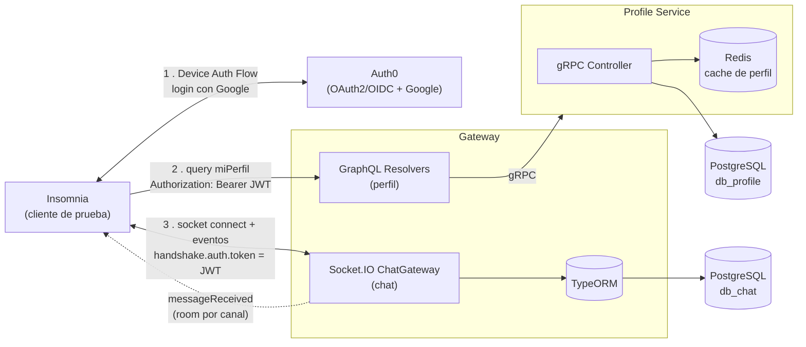
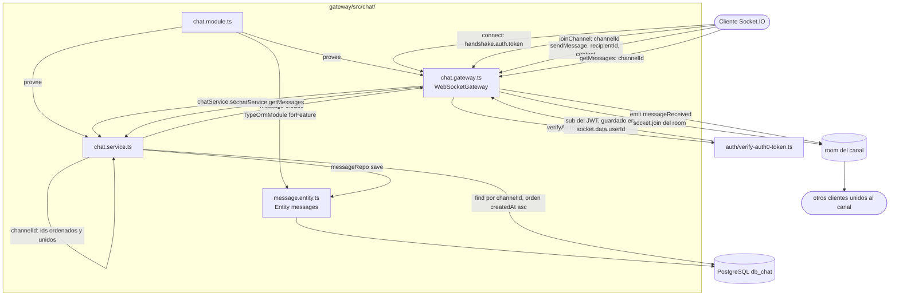
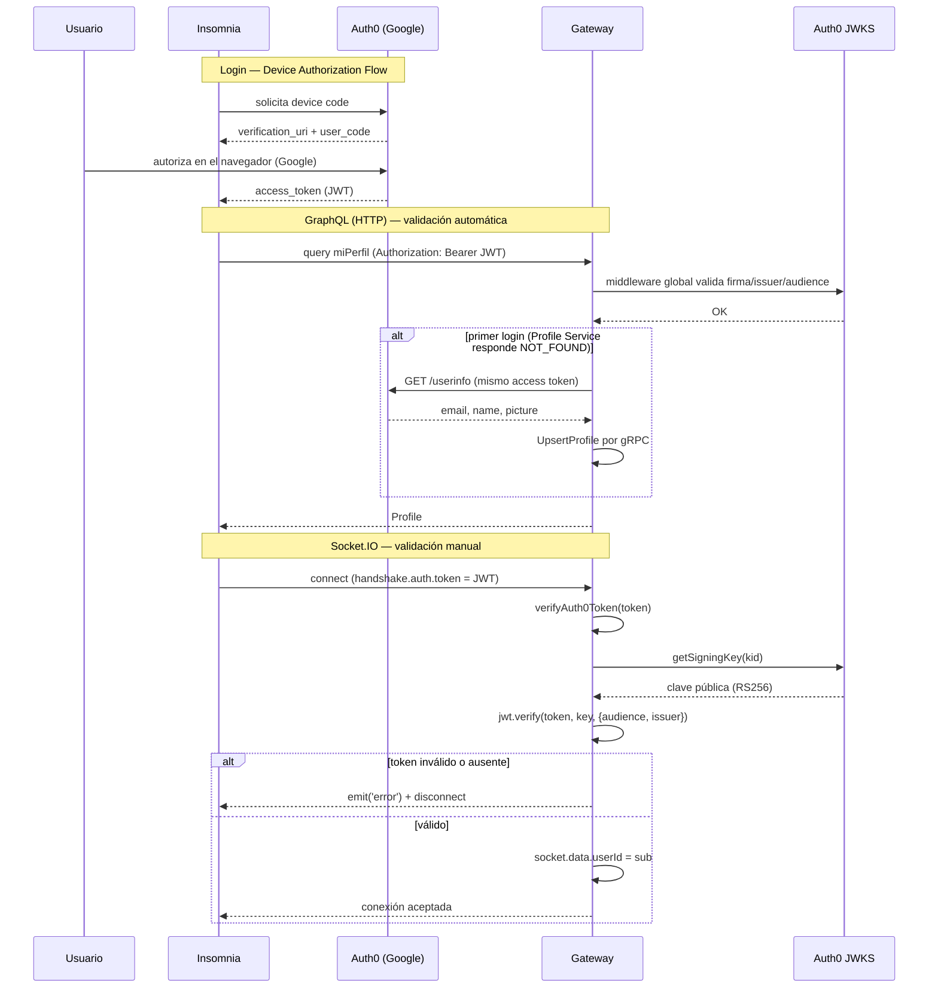

# Internal Chat System

Sistema interno de chat en tiempo real entre usuarios autenticados, construido con una arquitectura de microservicios (GraphQL para perfil, Socket.IO para chat, gRPC entre el Gateway y Profile Service). Proyecto de práctica de system design.

## Qué hace

- Login con Google vía Auth0.
- Chat 1 a 1 en tiempo real entre compañeros.
- Alerta en tiempo real (evento `messageReceived` de Socket.IO) cuando llega un mensaje nuevo.
- Todo containerizado con Docker, se levanta con un solo comando (`docker compose up`).

**Sin frontend** — es un proyecto de práctica de arquitectura backend. Todo se prueba con **Insomnia** (soporta GraphQL, Socket.IO y gRPC nativamente).

## Stack

- **Auth**: Auth0 (OAuth 2.0 / OIDC + Google)
- **API**: GraphQL en el Gateway, con resolvers manuales (sin Federation)
- **Comunicación interna**: gRPC (Gateway ↔ Login/Profile Service)
- **Tiempo real**: Socket.IO (eventos con ack + rooms por canal)
- **Base de datos**: PostgreSQL (una base por servicio)
- **Cache**: Redis (perfil de usuario)
- **Infra**: Docker + Docker Compose

## Arquitectura



El Gateway persiste el chat directo (sin ningún proceso intermedio); Profile Service sigue siendo el único servicio externo real, por gRPC.

Documentación técnica completa, con el flujo detallado de un mensaje y las decisiones de diseño: [`docs/ARQUITECTURA.md`](./docs/ARQUITECTURA.md).

### Chat — estructura y flujo de un mensaje

`gateway/src/chat/` completo: quién arma a quién, y qué pasa desde que un cliente manda `sendMessage` hasta que el otro lo recibe.



Puntos clave: el `channelId` nunca se persiste ni se busca — se deriva ordenando los dos IDs, así da igual quién le escribe a quién. El `senderId` que manda el cliente se ignora siempre; se usa el `sub` validado del JWT. Si el destinatario no está conectado, el mensaje queda igual en `db_chat` y lo recupera con `getMessages` al reconectar.

### Auth — validación de JWT (HTTP y WebSocket)

Dos caminos distintos porque el handshake de un socket no pasa por middleware de Express: en GraphQL la validación es automática (`express-oauth2-jwt-bearer`), en Socket.IO es manual (`auth/verify-auth0-token.ts`).



Orden de construcción del proyecto, por fases: [`docs/PLAN_IMPLEMENTACION.md`](./docs/PLAN_IMPLEMENTACION.md).

## Servicios

| Servicio | Rol | Protocolo |
|---|---|---|
| `gateway` | Valida auth, expone perfil y chat, persiste el chat directo en Postgres | GraphQL + Socket.IO hacia el cliente |
| `profile-service` | Perfil de usuario | gRPC |

## Cómo correr el proyecto

Copiar `.env.example` → `.env` en `gateway/` y `profile-service/` (Auth0 ya viene con los valores de este proyecto), y despues:

```bash
docker compose up
```

Levanta Postgres, Redis, `profile-service` y `gateway` — este último queda escuchando en `localhost:4001`.

## Estructura del repo

```
.
├── docs/
│   ├── ARQUITECTURA.md
│   └── PLAN_IMPLEMENTACION.md
├── postgres/
│   └── init.sql
├── gateway/            # Nest — GraphQL + Auth0 + cliente gRPC + Socket.IO/chat (TypeORM)
├── profile-service/    # Nest — gRPC + TypeORM + Redis
└── docker-compose.yml
```
